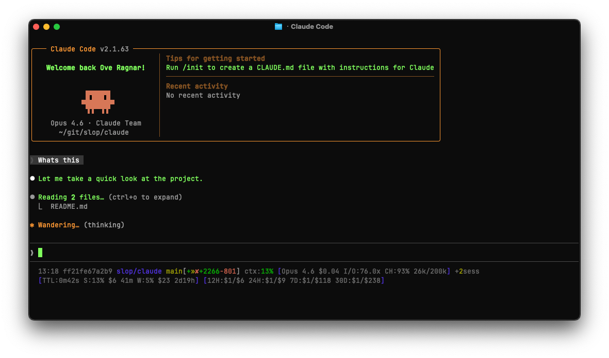
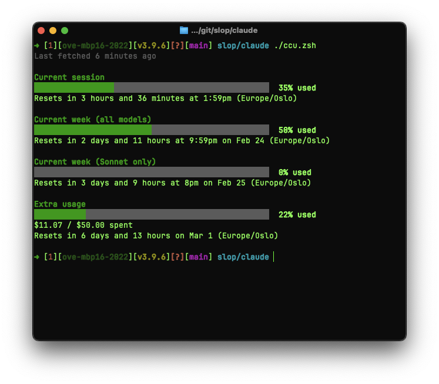

# Claude slop

## Claude Code statusline

* Timestamp of when it was invoked
* Hostname (disabled by default)
* Current working directory
* Git branch and status (conflicts, staged, renamed, deleted, modified, untracked, stashed, ahead/behind/diverged)
* Number of dogcat issues in review/progress
* Lines added/removed
* Current model and context usage
* Rate limit status (session/week % with reset countdowns)
* Sonnet-specific usage % with reset countdown (hidden below 25% by default)
* Extra usage spend/limit (hidden when session usage < 60% by default)
* TTL countdown until next usage data refresh
* Cost estimation for the current Claude Code session

## CCU — Claude Code Usage

A terminal dashboard that displays your Claude Code rate limit and usage status, similar to the `/usage` screen but accessible outside of Claude Code.

Shows:

* Current session usage % with reset countdown
* Weekly usage % (all models) with reset countdown
* Sonnet-specific usage % with reset countdown
* Extra usage spend/limit with reset countdown
* Human-readable reset times in your local timezone

Requires `jq` and the companion `get_usage.py` script. Run with `--force` / `-f` to bypass the cache.

## Installation

Tell your agent to read this repository and <https://code.claude.com/docs/en/statusline>, and ask it to help you integrate it into your workflow.
