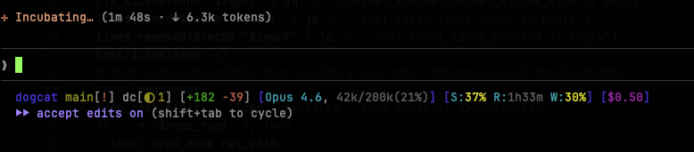

# Claude slop

Claude Code statusline with:

* Hostname (disabled by default)
* Current working directory
* Git branch and status (staged, unstaged, untracked files, ahead/behind)
* Number of dogcat issues in review/progress
* Lines added/removed
* Current model and context usage
* Rate limit status
* Cost estimation for the current Claude Code session

Ask your agent to read <https://code.claude.com/docs/en/statusline> and integrate it.
