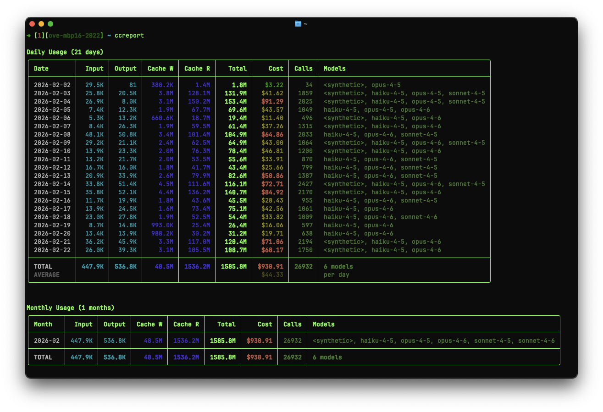

# Claude slop

## Claude Code statusline

* Timestamp of when it was invoked
* Hostname (disabled by default)
* Current working directory
* Git branch and status (conflicts, staged, renamed, deleted, modified, untracked, stashed, ahead/behind/diverged)
* Number of dogcat issues in review/progress
* Lines added/removed
* Current model and context usage with prompt cache hit rate (CH%)
* I/O ratio — output/input token ratio for the session (e.g. 2.3x)
* Cost estimation for the current Claude Code session
* Rate limit status (session/week % with reset countdowns)
* Sonnet-specific usage % with reset countdown (hidden below 25% by default)
* Extra usage spend/limit (hidden when session usage < 60% by default)
* TTL countdown until next usage data refresh
* Active parallel projects count (distinct project folders from last 15 min)


## CCU — Claude Code Usage

A terminal dashboard that displays your Claude Code rate limit and usage status, similar to the `/usage` screen but accessible outside of Claude Code.


Shows:

* Current session usage % with reset countdown
* Weekly usage % (all models) with reset countdown
* Sonnet-specific usage % with reset countdown
* Extra usage spend/limit with reset countdown
* Human-readable reset times in your local timezone

Requires `jq` and the companion `get_usage.py` script. Run with `--force` / `-f` to bypass the cache.

## CCReport — Claude Code Report

Analyzes Claude Code token usage and costs from local JSONL session logs. Parses the session files in `~/.claude/projects/` and `~/.config/claude/projects/` to produce rich terminal reports.



Reports:

* **Daily** — per-day token breakdown with optional per-model detail (`--breakdown`)
* **Monthly** — aggregated by month
* **Project** — top 20 projects ranked by cost, with model mix and averages
* **Session** — top sessions ranked by cost, with project name, model mix, and averages

Features:

* Tiered pricing support (base vs 200K+ context rates)
* Prompt cache token tracking (cache write and cache read)
* Per-model cost calculation for Opus, Sonnet, and Haiku
* Deduplication across session files
* Filter by date range (`--since` / `--until`) and project (`--project`)
* JSON output (`--json`) for programmatic use

Run with no arguments to see all four reports, or pick one:

```
ccreport.py                          # all reports
ccreport.py daily --breakdown        # daily with per-model detail
ccreport.py project --limit 10       # top 10 projects by cost
ccreport.py session --limit 10       # top 10 sessions by cost
ccreport.py daily --since 20260201 --project myapp
```

Requires `uv` (used as an inline script via `uv run --script`).

## Installation

Tell your agent to read this repository and <https://code.claude.com/docs/en/statusline>, and ask it to help you integrate it into your workflow.
