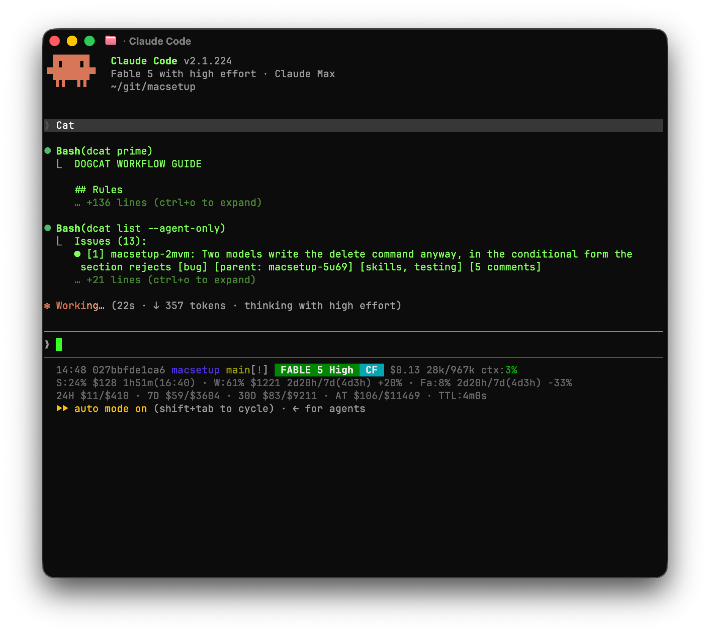
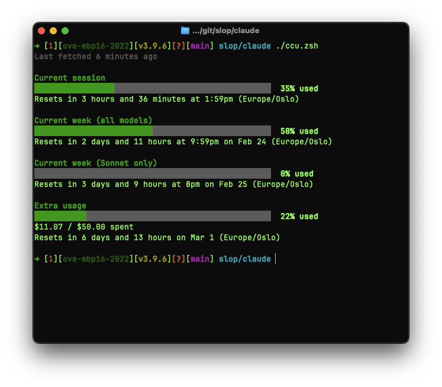
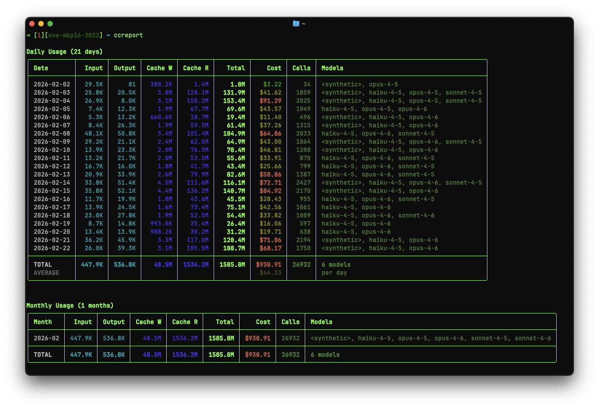

# Claude Code tooling

Status line, usage dashboard, cost reporting and hooks for Claude Code. Public
copy of what I run on my own machines. The private setup repo it comes from
links all of this into `~/.claude/` from a symlink manifest; the setup below is
the manual version of that, and works from a clone in any directory.

## What's here

| Path | What it is |
|---|---|
| `statusline_command.py` | The status line. Every segment is toggled by a `CLAUDE_STATUSLINE_*` env var; the script's module docstring lists them with defaults. Layout adapts to terminal width at 150 columns: two lines wide, four narrow. |
| `statusline-command_x.sh` | The wrapper `settings.json` points at. It finds the script in its own directory, so the clone can live anywhere. Its exports are my per-machine overrides, each written `${VAR:-default}` so the environment still wins; segment defaults live in the script itself. |
| `ccu.zsh` + `get_claude_usage.py` | `ccu` — terminal dashboard for the numbers `/usage` shows, with reset countdowns. Reads the OAuth token from the macOS Keychain or `~/.claude/.credentials.json`, cached 10 minutes. |
| `ccreport.py` | `ccreport` — token and cost report over the local JSONL logs, by day, month, project, session or account. Costs in USD and NOK (Norges Bank spot rate, 25 % MVA added unless `--no-mva`). |
| `claudemem` | TUI for browsing the Claude Code memories belonging to the current git repo — navigate, edit, delete with undo. `--json` prints them instead. |
| `claudem` | Launcher: `claudem <haiku\|sonnet\|opus\|fable> [low\|medium\|high\|xhigh\|max]` starts Claude Code with an explicit model and reasoning effort (default high). Single-letter shorthands, arguments in any order, everything else passed through to `claude`. |
| `cf`, `co` | Orchestrator wrappers, one script under two names: `cf` starts `claudem f` and `co` starts `claudem o`, each with an injected system prompt telling the session to delegate implementation work to the `cfcoder` agent. The two prompts differ only in the reason for the split — `cf` reserves a cheaper session model for judgment, `co` is already Opus and splits for context isolation. The script dispatches on its invoked name (`c<model>[<effort>]`), so symlinks like `cfl` or `com` give other model/effort combos — only the bare names `cf` and `co` inject. |
| `cfcoder.md` | The agent definition `cf` and `co` delegate to: Opus at high effort doing the implementation. Only takes effect from an agents dir Claude Code reads — see below. |
| `pricing.py`, `exchange.py`, `cache_db.py` | Model price table, USD/NOK rates, and the shared SQLite cache all of the above read. |
| `hooks/` | `block-git-stash-worktree.sh`, a `PreToolUse` hook that blocks stash and worktree commands. Test suite in `hooks/block-git-stash-tests/` (payloads built inline — no fixture files). |

Requirements: `uv` (the status line, `ccreport` and `claudemem` resolve their
own dependencies through PEP 723 shebangs), a system Python 3.12+ for
`get_claude_usage.py`, `zsh` for `ccu`, `claudem` and `cf`/`co`, and `jq` for the
git-stash hook. That hook also wants `perl` — without it, it falls back to
substring matching and over-blocks. Some pieces are macOS-only: the Keychain token lookup
(`security`) and the battery (`pmset`) status line segment.

## Status line



In `~/.claude/settings.json`:

```json
{
  "statusLine": {
    "type": "command",
    "command": "bash /path/to/slop/claude/statusline-command_x.sh"
  }
}
```

Segment defaults live in the script; the wrapper is the seam where per-machine
`CLAUDE_STATUSLINE_*` overrides go. The exports it ships with are mine — start
by deleting them and add back what you want off or on. Each is written
`${VAR:-…}`, so anything already in the environment still wins.

The wrapper is doing two things for render latency, and both are why the script
is named with an underscore. It imports `statusline_command` through a one-line
`-c` stub rather than running the file as a script: CPython writes
`__pycache__` only for modules it imports, so run as a script the whole 80-odd
KB is re-tokenized on every render. And it caches the path to the script env's
interpreter under `$TMPDIR`, keyed on the mtimes of both files, because the
`uv` shebang costs ~40 ms of resolver each time. Without `uv` it falls back to
the shebang, which is slower but always correct.

## ccu



`ccu.zsh` finds `get_claude_usage.py` through `$SETUP_DIR`, which defaults to
`~/git/macsetup` — point it at the clone instead:

```bash
alias ccu='SETUP_DIR=/path/to/slop /path/to/slop/claude/ccu.zsh'
```

## ccreport



```bash
alias ccreport=/path/to/slop/claude/ccreport.py
```

## cf and co

`cf` needs `claudem` (and `claude`) on `PATH`, and `cfcoder.md` in an agents
directory Claude Code actually loads — `~/.claude/agents/` for all projects, or
`.claude/agents/` in the repo you run it from:

```bash
cp /path/to/slop/claude/cfcoder.md ~/.claude/agents/
```

Without the agent installed, the injected prompt tells the session to delegate
to an agent that doesn't exist.

`cf` and `co` are the same script under two names — it reads its own invoked
name to pick model and effort, so the name is the whole configuration. Any
other combination is a symlink away:

```bash
ln -s /path/to/slop/claude/cf ~/bin/cfl   # fable, low effort, no injection
ln -s /path/to/slop/claude/cf ~/bin/com   # opus, medium effort, no injection
```

## Hooks

```json
{
  "hooks": {
    "PreToolUse": [
      {
        "matcher": "Bash|Agent|Task|Workflow",
        "hooks": [
          {
            "type": "command",
            "command": "/path/to/slop/claude/hooks/block-git-stash-worktree.sh",
            "statusMessage": "Checking for blocked git commands..."
          }
        ]
      }
    ]
  }
}
```

The test suite takes a `HOOK_PATH` override and exits with the failure count:

```bash
claude/hooks/block-git-stash-tests/run-tests.sh
```

## Project grouping (ccreport)

`ccreport` groups records into projects by a pure function over signals captured
at parse time, so regrouping never needs a re-parse:

1. **Git remote** — resolved from the session's `cwd` while the dir still exists
   (`git config remote.origin.url`, normalized to `host/path`). Grouped by the
   repo's *name* (last path segment), so moving a repo or changing its host/org
   (GitLab → GitHub) keeps history together. This is the durable identity: it
   survives the working dir being moved or deleted.
2. **Repo-root path** — for repos with no remote, the segment just under a
   repo root. `~/git` is always a repo root; per-machine extras (a config
   file can only add roots, never remove the baseline) live in
   `${XDG_CONFIG_HOME:-~/.config}/macsetup/claude/ccreport.toml`:

   ```toml
   repo_roots = ["~/dev", "~/dev/privat"]
   ```

   Matching is longest-prefix, so nested roots are fine in any order.
   Collapses subdirectories and worktrees. Editing the config invalidates the
   report cache, so records regroup on the next run.
3. **Dir-name / frozen label** — fallback for orphaned records whose source
   JSONL is already purged and whose dir can't be reconstructed.

### Manual merges and renames

The automatic rules can't know that a *renamed* repo (`ren.no` → `ren-platform`)
is the same project — that's human knowledge. Override rules live in the local
`project_overrides` table (never committed; snapshotted with the rest of the DB):

```bash
ccreport overrides                          # list active rules
ccreport merge <from-name> <into-name>      # group one name into another
ccreport merge <remote> <into> --kind remote
ccreport merge <cwd-prefix> <into> --kind cwd_prefix
ccreport unmerge <value>                    # remove a rule
```

A repo rename is one `ccreport merge <new-name> <old-name>` away. Rules apply at
report time, so the change shows up on the next run with no re-parse.

## Accounts (ccreport)

A session JSONL never names the account that paid for it, and `~/.claude.json`
only knows who is signed in *now*. So the status line is the capture point: on
every render it reads `oauthAccount` and appends to an `account_events` change
log when it differs from the newest row. Attribution only works if you run the
status line — that is the only thing that fires often enough to catch a
mid-session `/login`.

```bash
ccreport account              # per-account table, sorted by cost
ccreport -a work@example.com  # substring filter, works on every report
ccreport -a unknown           # everything from before capture started
```

`ccreport` stamps each record at read time from the newest event at or before
its timestamp, so a switch you record today re-attributes past reports with no
re-parse. The email is the bucket label, plus the organization name when one
address fronts two accounts (`me@example.com (Work AS)`).

Everything logged before you installed the status line reports as `unknown`.
`ccreport adopt` claims it for the account signed in now, by writing a single
backdated event; `ccreport adopt --remove` deletes that one row and nothing
else.

## Day rollups (ccreport)

A bare `ccreport` used to deserialize every cached record — on my machine ~95k
rows, more than half of them duplicates that dedup then discards — to fold them
into five tables. Days older than 14 now come out of `ccreport_rollups`
instead: one row per (day, Oslo date, session, project, model, account),
holding summed tokens, the summed cost and the call count. Steady-state runtime
drops from ~0.9 s to ~0.4 s; the run that rebuilds pays roughly what every run
used to.

Rollups serve the unfiltered report and nothing else.
`--since/--until/--project/--account`, `--json` and `ccreport adopt` all take
the full record path — each of them selects on something a rollup row has
aggregated away, and `adopt` needs the record-level timestamps that split a day
at the first captured account.

The rows are only ever as good as the fingerprint stored beside them, written
in the same transaction. It covers everything a stored row froze an answer
about: the cache salt, a SHA256 of `pricing.py`, the override rules, the
account change log, the local timezone, the cutoff day, and the (path, mtime,
size) of every cached file holding a pre-cutoff record. Any mismatch rebuilds
inline from the same post-dedup stream a report reads — not from a `GROUP BY`
over the raw table, which would count the duplicates and freeze the project
names and account attribution that are read-time by design.

Losing the table costs one slow run: every row is derivable from
`ccreport_records`.

## Cache DB safety

The shared cache (`~/.cache/macsetup/claude/cache.db`) holds token/cost history
that can't always be reconstructed from JSONL — Claude Code purges its own
logs, and orphaned records in the cache are the only surviving record.

`cache_db.py` takes a daily online backup to
`~/.local/share/macsetup/claude/snapshots/YYYY-MM-DD.db` (UTC), and always
takes one before schema work or migrations touch the live DB. Snapshots live
outside `~/.cache` so a cache sweep can't take the live DB and all its backups
out in one pass. Default retention is 14 snapshots.

Who pays for the copy: the first process to open the DB after UTC midnight,
except that the status line render and `ccreport` both defer
(`CLAUDE_CACHE_SNAPSHOT_DEFER=1`) and the status line's detached refresh
subprocess picks it up instead. A render is the most frequent first-toucher and
has no business copying the whole DB, and a report you are waiting on is no
better a place for it. The copy is stepped (1024 pages at a time) so a writer
isn't starved for its duration, and the day's tmp file is claimed with an
exclusive create so concurrent starters don't each run a full copy. The
pre-migration snapshot ignores the deferral: whatever process is about to
migrate takes it first, synchronously.

A sanity check rides the same cadence — the run that writes the day's snapshot,
plus any run that migrated data — so renders pay nothing. It compares
`ccreport_records` against the most recent snapshot from a *prior* day, on both
row count and number of rows carrying a cost, and warns with the restore
command (`cp <snapshot> <db>`) if either drops more than 10 %. The cost
aggregate is there because an over-broad `SET cost = NULL` leaves every row in
place. It also reports records left with no `ccreport_files` parent, which no
reader can reach.

Overrides:

| Env var | Effect |
|---------|--------|
| `CLAUDE_CACHE_SNAPSHOT_DIR`     | Override snapshot directory |
| `CLAUDE_CACHE_SNAPSHOT_KEEP`    | Retention count (default 14) |
| `CLAUDE_CACHE_SNAPSHOT_DISABLE` | `=1` disables snapshots |
| `CLAUDE_CACHE_SNAPSHOT_DEFER`   | `=1` skips only the daily one (set by the status line and ccreport) |
| `CLAUDE_CACHE_SANITY_DISABLE`   | `=1` disables the sanity check |
| `CLAUDE_CACHE_SANITY_ABORT`     | `=1` raises instead of warning on drop |
