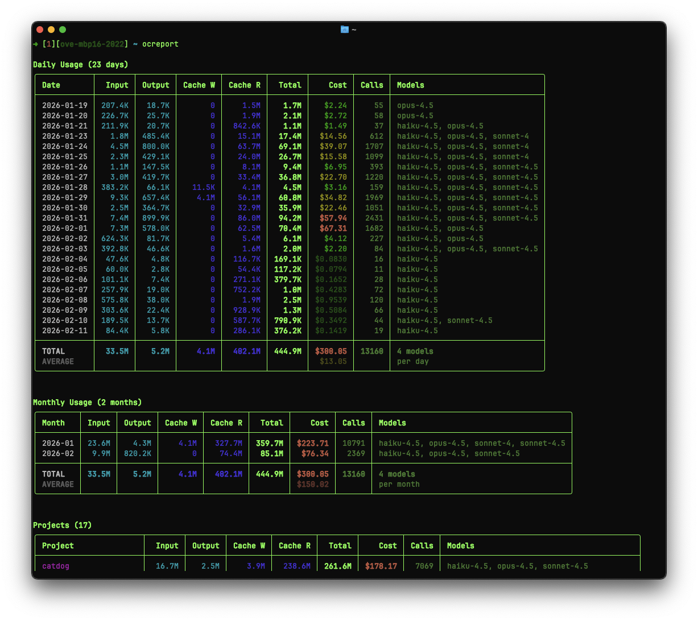

# OpenCode slop

## OCReport — OpenCode Report

Analyzes OpenCode token usage and costs from local JSON session logs. Parses the message files in `~/.local/share/opencode/storage/` to produce rich terminal reports.

Only GitHub Copilot usage is included. Supported model families: Claude, GPT, and Gemini.



Reports:

* **Daily** — per-day token breakdown with optional per-model detail (`--breakdown`)
* **Monthly** — aggregated by month
* **Project** — top 20 projects ranked by cost, with model mix and averages
* **Session** — top sessions ranked by cost, with project name, model mix, and averages

Features:

* Tiered pricing support (base vs 200K+ context rates)
* Prompt cache token tracking (cache write and cache read)
* Per-model cost calculation for Claude (Opus, Sonnet, Haiku), GPT (5-mini), and Gemini (3 Pro)
* Deduplication across message files
* Filter by date range (`--since` / `--until`) and project (`--project`)
* JSON output (`--json`) for programmatic use

Run with no arguments to see all four reports, or pick one:

```
ocreport.py                          # all reports
ocreport.py daily --breakdown        # daily with per-model detail
ocreport.py project --limit 10       # top 10 projects by cost
ocreport.py session --limit 10       # top 10 sessions by cost
ocreport.py daily --since 20260201 --project myapp
```

Requires `uv` (used as an inline script via `uv run --script`).

## Installation

Tell your agent to read this repository and ask it to help you integrate it into your workflow.
